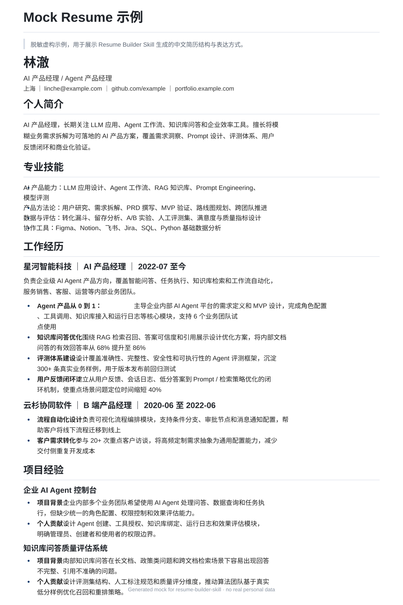

# 📄 Resume Builder Skill：你的 AI 简历专家 | 自动生成简历 & 求职找工作优化工具

> **Drop messy career notes into any Agent, get a polished Chinese resume in HTML + DOCX.**
>
> 适用于任何支持 System Prompt / Skill 的 Agent 或 LLM：输入旧简历、JD、项目流水账或零散背景，输出 ATS 友好的中文简历和高阶求职建议。

> **不用反复打磨措辞，不用花钱找人优化，不用花大量时间整理材料。**  
> **把你有的东西——旧简历、目标岗位JD、随手写的工作流水账、工作项目文档——统统丢给模型，剩下的交给这个 Skill。**
>
> Drop anything you have to any agent or LLM. No polishing, no expensive resume consultants, no prep work needed.  
> The skill handles resume generation, ATS optimization, and career advice — all in one shot.

---

## ✨ 为什么选择这个简历生成 Skill？

传统简历优化的问题：找人改，贵且慢；自己写，来回打磨措辞耗时耗力；用 AI，又总是需要反复"调教"才能得到满意的结果。

**Resume Builder Skill 的逻辑是：你负责提供素材，它负责转化成专业简历。**

- 🎯 **极简输入** — 旧简历、JD、工作流水账、项目文档，任何格式统统可以，一次输入直接成型

## 📋 输出示例

### Mock 简历效果图

下面是一份由 Resume Builder Skill 生成的脱敏虚构简历示例，用于展示最终简历的版式、层级和「加粗概括 + 冒号 + 具体贡献」的经历写法。

